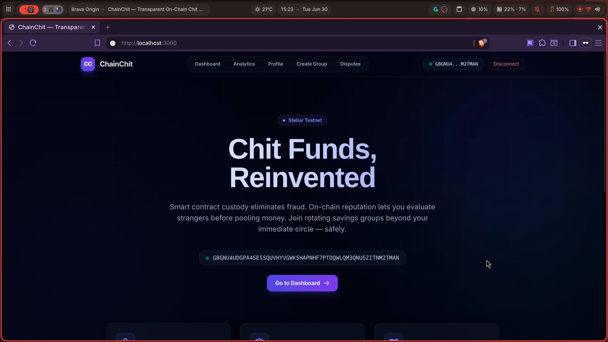
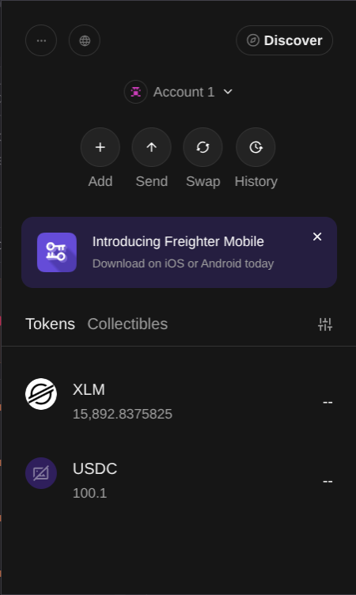
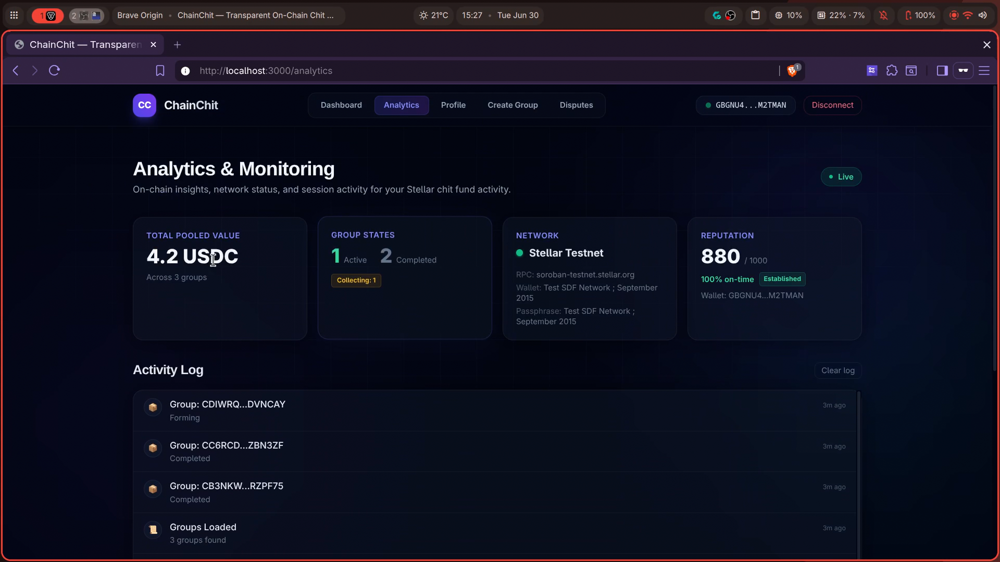
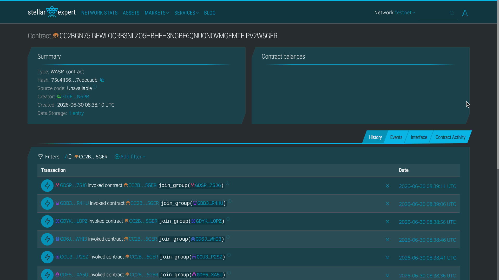
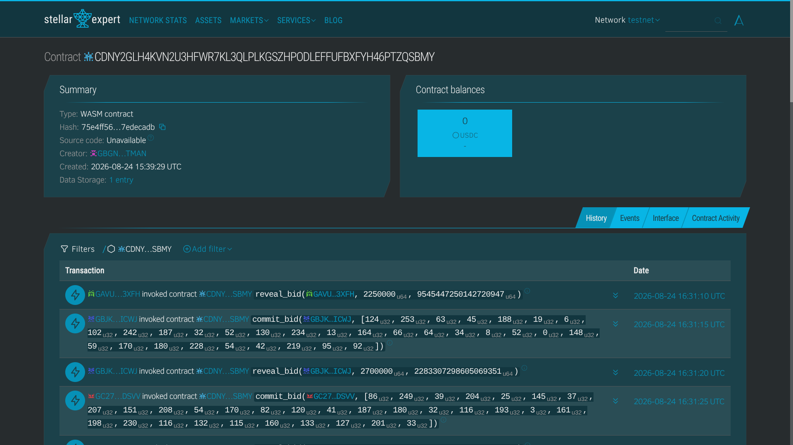
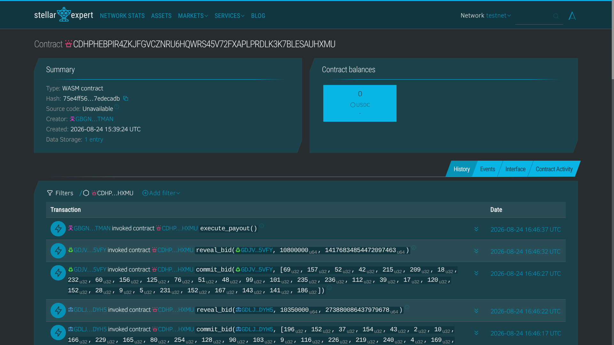

# ChainChit — On-Chain Chit Fund Platform on Stellar

[](https://github.com/sharifmdathar/ChainChit/actions/workflows/ci.yml)


**Live Application**: [chain-chit.vercel.app](https://chain-chit.vercel.app/)

**Demo Video**: *[Watch on YouTube](https://youtu.be/7CMEtcvsuiM)*
[](https://youtu.be/7CMEtcvsuiM)

**Pitch Deck**: [View on Canva](https://canva.link/6rhc38gmfemtrzn)

A production-ready decentralized chit fund (committee/rotating savings) platform built on Stellar Soroban smart contracts with a Next.js frontend.

## Table of Contents

- [What is a Chit Fund?](#what-is-a-chit-fund)
- [On-Chain Activity](#on-chain-activity)
- [Screenshots](#screenshots)
- [User Feedback](#user-feedback)
- [Improvement Plan](#improvement-plan-feedback-driven)
- [Monitoring & Analytics](#monitoring--analytics)
- [Quick Start](#quick-start)
- [Contract Lifecycle](#contract-lifecycle)
- [Bidding Mechanics](#bidding-mechanics)
- [Tech Stack](#tech-stack)
- [Project Structure](#project-structure)
- [Contract Deployment (Testnet)](#contract-deployment-testnet)
- [Contract Deployment (Mainnet)](#contract-deployment-mainnet)
- [Funding Users](#funding-users-mainnet-onboarding)
- [Roadmap](#roadmap)
- [License](#license)

## What is a Chit Fund?

A chit fund is a rotating savings scheme where a group of members contribute a fixed amount each cycle. One member wins the pooled amount each cycle through a competitive bidding process. The lowest unique bid wins — incentivizing participants to bid the smallest fee they're willing to accept for early pool access.

### Smart Contracts

| Contract | Purpose |
|----------|---------|
| **ChitGroup** | Core chit fund logic — group lifecycle, contributions, commit-reveal bidding, payouts |
| **Reputation** | On-chain reputation tracking — on-time payments, defaults, composite score (0–1000) |
| **Identity** | Sybil-resistant attestation — vouches weighted by vouchor's reputation score |
| **Dispute** | Multi-sig arbitration — 3-of-5 arbitrator voting with on-chain resolution |

### Key Features

- **Commit-Reveal Bidding**: SHA-256 commitment scheme hides bids until reveal phase. Lowest unique bid wins the pool.
- **Reputation System**: Composite score (0–1000) computed from payment history, cycle completions, dispute outcomes, and bid history.
- **Sybil-Resistant Identity**: Attestation weight equals the vouchor's reputation score — fake accounts with zero reputation carry zero weight.
- **Multi-Sig Disputes**: 3-of-5 arbitrator panel with automatic threshold resolution and on-chain enforcement.
- **Emergency Pause**: Admin-controlled circuit breaker halts all state transitions.
- **SEP-24 INR Ramp**: Anchor integration for bank-to-USDC deposits and withdrawals.

## On-Chain Activity

**53 testnet users** onboarded with real on-chain activity. The Green Belt
cohort (13 users) is joined this level by two fully-provisioned committees —
mirroring how a real chit-fund foreman stands up an entire committee for
members who aren't technical. Every member wallet was created, funded,
trustlined, and driven through the complete lifecycle: join → contribute →
commit-reveal bid → payout, across 2 full cycles.

| Detail | Group A | Group B | Group C | Group D |
|--------|---------|---------|---------|---------|
| **Contract** | [`CC2B…V2W5GER`](https://stellar.expert/explorer/testnet/contract/CC2BGN75IGEWLOCRB3NLZO5HBHEH3NGBE6QNUONOVMGFMTEIPV2W5GER) | [`CBWO…UONGQILA`](https://stellar.expert/explorer/testnet/contract/CBWO3KSGJM7TXTKONLDELGGOPQ42XZZZBXW2LTOFK6YSYB4KUONGQILA) | [`CDNY…TZQSBMY`](https://stellar.expert/explorer/testnet/contract/CDNY2GLH4KVN2U3HFWR7KL3QLPLKGSZHPODLEFFUFBXFYH46PTZQSBMY) | [`CDHP…SAUHXMU`](https://stellar.expert/explorer/testnet/contract/CDHPHEBPIR4ZKJFGVCZNRU6HQWRS45V72FXAPLPRDLK3K7BLESAUHXMU) |
| **Members** | 10 | 3 | 20 | 20 |
| **Contribution** | 5 USDC/cycle | 2.5 USDC/cycle | 1.5 USDC/cycle | 1.5 USDC/cycle |
| **Cycles run** | 3 | 6 | 2 (Completed) | 2 (Completed) |
| **Pool per cycle** | 50 USDC | 7.5 USDC | 30 USDC | 30 USDC |
| **Verify** | [Stellar Expert](https://stellar.expert/explorer/testnet/contract/CC2BGN75IGEWLOCRB3NLZO5HBHEH3NGBE6QNUONOVMGFMTEIPV2W5GER) | [Stellar Expert](https://stellar.expert/explorer/testnet/contract/CBWO3KSGJM7TXTKONLDELGGOPQ42XZZZBXW2LTOFK6YSYB4KUONGQILA) | [Stellar Expert](https://stellar.expert/explorer/testnet/contract/CDNY2GLH4KVN2U3HFWR7KL3QLPLKGSZHPODLEFFUFBXFYH46PTZQSBMY) | [Stellar Expert](https://stellar.expert/explorer/testnet/contract/CDHPHEBPIR4ZKJFGVCZNRU6HQWRS45V72FXAPLPRDLK3K7BLESAUHXMU) |

Per-member ledger with funding tx hashes: [docs/users_testnet.csv](docs/users_testnet.csv).
Cycle winners are readable on-chain via each contract's `get_cycle_state`.

## Screenshots

### Dashboard


### Freighter Wallet with USDC


### Analytics & Monitoring


### Stellar Expert Page of Deployed Contract 


### Blue Belt Committees — On-Chain Proof



## User Feedback

We collect structured feedback from every user via a Google Form
(name, email, wallet address, product rating 1–5). Responses are exported to an
Excel sheet for analysis and record-keeping.

- **Feedback form**: [Google Form](https://forms.gle/2gWMDTeXUNkMaUUB8)
- **Responses Sheet**: [docs/ChainChit_Feedback.xlsx](docs/ChainChit_Feedback.xlsx). Google Sheet link [here](https://docs.google.com/spreadsheets/d/1KuYY_jTOB1iRILea2qHQbf2mb1-KRJ9AtICIm3EyyEY/edit?usp=sharing)
- **User ledger**: [docs/USERS.md](docs/USERS.md) — every onboarded user with on-chain proof
- **Testnet provisioning ledger**: `docs/users_testnet.csv` — wallet addresses + tx hashes from committee provisioning runs
- **Monthly growth report**: [docs/GROWTH_REPORT.md](docs/GROWTH_REPORT.md)
- **SEP-24 anchor (mainnet)**: [docs/SEP24_MAINNET.md](docs/SEP24_MAINNET.md) — anchor research + funding fallback
- **X/Twitter launch**: [docs/LAUNCH_POST.md](docs/LAUNCH_POST.md) — launch thread draft + cadence

## Improvement Plan & Feedback Implementation

We have collected structured feedback from our users to continuously evolve the product. Below is the summary of onboarded users and the improvements made based on their feedback. Every shipped iteration is permanently tracked with its corresponding commit as evidence.

### Users Onboarded & Feedback Summary

| User ID | Name | Email | Wallet Address | Feedback Summary |
|---------|------|-------|----------------|------------------|
| 1 | Madhav Seth | madhav24100@iiitnr.edu.in | `GA7UV2JGKKWWVNFW...` | Checklist is a game changer for non-crypto friends. |
| 2 | Harsh Kaushik | harsh24100@iiitnr.edu.in | `GAAFEV3DJHVNQVUV...` | Solid overall. Pending state scared me more than it should have. |
| 3 | Aakash Sen | aakash24101@iiitnr.edu.in | `GAAN4I2QKYVVSSK4...` | A reminder email before commit/reveal deadlines would fix my only complaint. |
| 4 | Divyanshu Kumar | divyanshu24100@iiitnr.edu.in | `GABCDZAESF6SWXH4...` | Great idea but needs to hide more crypto complexity from beginners. |
| 5 | Parth Sodhan | parth24100@iiitnr.edu.in | `GABCEQAJTQRX47UJ...` | Reputation system is the killer feature. Tell everyone about it. |
| 6 | Raj Sahana | raj24100@iiitnr.edu.in | `GA6QDFMMAWC7Q7NG...` | Best chit fund experience I have had. Would love a Hindi interface later. |
| 7 | Md Athar Sharif | sharifmdathar@gmail.com | `GCOXBDHKUWWWWOAM...` | Lovely App, introduces transparency for a very scam-able financial process. |
| 8 | Gaurav Singh | gaurav24100@iiitnr.edu.in | `GBUACYFDSSLWRXTY...` | Please prioritize mobile responsive bidding. |
| 9 | Mayank Dixit | mayank24100@iiitnr.edu.in | `GC3HS75RUNR3ABPR...` | Add AXLM or other stablecoin pools and I will bring my whole family. |
| 10 | Vaibhav Singh | vaibhav24100@iiitnr.edu.in | `GCLCO6T6563QGYJA...` | Time-based phases need push notifications badly. |
| 11 | Abhay Yadav | abhay24100@iiitnr.edu.in | `GCM6WWP5E7KZYSZS...` | Onboarding was smoother than most crypto apps I have tried. |
| 12 | Dhanesh Sharma | dhanesh24100@iiitnr.edu.in | `GCV6Z4KPWJS2DYLQ...` | Fix wallet connectivity and simplify navigation before scaling users. |
| 13 | Palak Vastrakar | palak24100@iiitnr.edu.in | `GCWXIEGJPE3VHDEH...` | Localization would unlock the actual chit fund demographic. |
| 14 | Tarun Bhagat | tarun24100@iiitnr.edu.in | `GCXZWFXPCMNDJ74C...` | Dispute resolution is what convinced me this is serious infrastructure. |
| 15 | Tejasvi Sinha | tejasvi24100@iiitnr.edu.in | `GBCP6UANG7I2LXAS...` | Foreman-style setup is genius. My whole office team onboarded in one evening. |

### Feedback Implementation

| User ID | Name | Email | Wallet Address | Feedback Summary | Improvement Made | Git Commit ID |
|---------|------|-------|----------------|------------------|------------------|---------------|
| 1 | Madhav Seth | madhav24100@iiitnr.edu.in | `GA7UV2JGKKWWVNFW...` | Onboarding was confusing for beginners; needed a guided setup. | Added dismissible 4-step onboarding checklist | [`f24bbd7`](https://github.com/sharifmdathar/ChainChit/commit/f24bbd7) |
| 4 | Divyanshu Kumar | divyanshu24100@iiitnr.edu.in | `GABCDZAESF6SWXH4...` | Onboarding was confusing for beginners; needed a guided setup. | Added dismissible 4-step onboarding checklist | [`f24bbd7`](https://github.com/sharifmdathar/ChainChit/commit/f24bbd7) |
| 11 | Abhay Yadav | abhay24100@iiitnr.edu.in | `GCM6WWP5E7KZYSZS...` | Onboarding was confusing for beginners; needed a guided setup. | Added dismissible 4-step onboarding checklist | [`f24bbd7`](https://github.com/sharifmdathar/ChainChit/commit/f24bbd7) |
| 3 | Aakash Sen | aakash24101@iiitnr.edu.in | `GAAN4I2QKYVVSSK4...` | Needed a way to track cycle progress and see who won past cycles. | Built `CycleProgress`: per-cycle chips with winner tooltips | [`1d1261b`](https://github.com/sharifmdathar/ChainChit/commit/1d1261b) |
| 13 | Palak Vastrakar | palak24100@iiitnr.edu.in | `GCWXIEGJPE3VHDEH...` | Needed a way to track cycle progress and see who won past cycles. | Built `CycleProgress`: per-cycle chips with winner tooltips | [`1d1261b`](https://github.com/sharifmdathar/ChainChit/commit/1d1261b) |
| 8 | Gaurav Singh | gaurav24100@iiitnr.edu.in | `GBUACYFDSSLWRXTY...` | Bid Insight panel stopped me from duplicating someone's bid. | Added Live Bid Insight panel with "taken amounts" chips | [`78f7fe8`](https://github.com/sharifmdathar/ChainChit/commit/78f7fe8) |
| 15 | Tejasvi Sinha | tejasvi24100@iiitnr.edu.in | `GBCP6UANG7I2LXAS...` | Organizing and standing up full committees took too much manual work. | Created `provision_committee.ts` organizer tooling | [`fb4bf8d`](https://github.com/sharifmdathar/ChainChit/commit/fb4bf8d) |

## Monitoring & Analytics

- **Vercel Analytics** — Page views and Core Web Vitals tracking (built-in with Vercel deployment)
- **Error Monitoring** — Console error logging via `react-hot-toast` with structured error messages for simulation failures, transaction timeouts, and wallet errors
- **Transaction Status** — On-chain transaction polling with status tracking (pending → success/fail) with full XDR error details

## Quick Start

### Prerequisites

- Rust 1.84+ with `wasm32v1-none` target
- Node.js 20+
- A Stellar wallet (Freighter recommended)

### Build Contracts

```bash
# Add WASM target if needed
rustup target add wasm32v1-none

# Build all contracts
stellar contract build
```

### Run Tests

```bash
cargo test
```

### Frontend

```bash
cd frontend
npm install

# Copy env template and fill in contract IDs after deployment
cp .env.local.example .env.local

npm run dev
```

### Deploy Contracts

```bash
# Set admin secret key
export SOROBAN_SECRET_KEY=S...

# Deploy to testnet
NETWORK=testnet npx tsx scripts/deploy.ts
```

The deploy script outputs contract IDs and writes them to `frontend/.env.local`.

## Contract Lifecycle

```
Forming → Collecting → Bidding → Payout → (next cycle or Completed)
   ↑          ↓
   └──── Pause └──→ Unpause
```

1. **Forming**: Admin creates group with contribution amount, member count, and cycle count.
2. **Collecting**: Members join and pay contributions for the current cycle.
3. **Bidding**: Members commit sealed bids (SHA-256), then reveal them.
4. **Payout**: Lowest unique bid wins the pool. Payout is disbursed.
5. **Completed**: After all cycles finish, the group closes.

## Bidding Mechanics

The platform uses a **commit-reveal** scheme to prevent bid sniping:

1. **Commit Phase**: Member submits `SHA-256(amount_le || nonce_le)`. The bid amount is hidden.
2. **Reveal Phase**: Member reveals their amount and nonce. The commitment is verified on-chain.
3. **Lowest Unique Bid Wins**: The member with the smallest bid that no one else matched wins the pool for that cycle.

The bid amount is the fee a member accepts for early access to the pooled funds. Lower bids are more competitive.

## Tech Stack

- **Contracts**: Rust + Soroban SDK v22
- **Frontend**: Next.js 14 (App Router) + TypeScript (strict mode)
- **Wallet**: @creit.tech/stellar-wallets-kit (Freighter, xBull, Lobstr)
- **Blockchain**: Stellar + Soroban RPC
- **Fiat Ramp**: SEP-24 anchor integration (INR ↔ USDC)
- **Styling**: Tailwind CSS with custom stellar/chit theme

## Project Structure

```
chainChit/
├── contracts/
│   ├── chit_group/     # Core chit fund contract
│   ├── reputation/     # On-chain reputation tracking
│   ├── identity/       # Attestation/vouching system
│   └── dispute/        # Multi-sig arbitration
├── frontend/
│   ├── src/
│   │   ├── app/        # Next.js App Router pages
│   │   ├── components/ # React components
│   │   ├── hooks/      # Wallet & contract hooks
│   │   ├── lib/        # Stellar SDK, contract calls, utils
│   │   └── types/      # TypeScript interfaces
│   └── ...
├── scripts/
│   └── deploy.ts       # Contract deployment script
├── .github/
│   └── workflows/
│       └── ci.yml      # CI pipeline
└── docs/
    ├── ARCHITECTURE.md
    ├── CONTRACT_API.md
    ├── DEPLOYMENT.md
    ├── SECURITY_AUDIT_CHECKLIST.md
    ├── FEEDBACK_FORM.md    # Google Form question template
    ├── USERS.md            # Mainnet user ledger
    └── GROWTH_REPORT.md    # Monthly growth reporting
```

## Contract Deployment (Testnet)

| Contract | Address |
|----------|---------|
| **Factory** | `CAJBU4IDXR5PFHY3AKRDUS2LTRID7ONORUXJJYG5LDPTG2QMREINLF6V` |
| **ChitGroup** | Deployed dynamically via factory |
| **Reputation** | `CDA53WAWFZ2VVOXUUXNQWVETL3KX5DTZ4O6YWNFKJIGNKLBF3NZ5HGSR` |
| **Identity** | `CAG3PALD7IHTXSJHIAVWWF2N6YICTMU2EO5JK5O3DC7HEJVU4L5JSSSL` |
| **Dispute** | `CCX3JYBOO3LHIRKIDXTO755OBUL6W7GSZKPFNPWCTN3NNLZU2WX4OK3B` |
| **USDC** | `CBIELTK6YBZJU5UP2WWQEUCYKLPU6AUNZ2BQ4WWFEIE3USCIHMXQDAMA` |

Network: **Stellar Testnet** (Soroban RPC: `https://soroban-testnet.stellar.org`)

## Contract Deployment (Mainnet)

Level 6/7 target. Deployment in progress. Addresses will be recorded here after `NETWORK=mainnet npx tsx scripts/deploy.ts`.

| Contract | Address |
|----------|---------|
| **Factory** | _pending_ |
| **Reputation** | _pending_ |
| **Identity** | _pending_ |
| **Dispute** | _pending_ |
| **USDC (Circle SAC)** | `CCW67TSZV3SSS2HXMBQ5JFGCKJNXKZM7UQUWUZPUTHXSTZLEO7SJMI75` |

Network: **Stellar Mainnet** (Soroban RPC: `https://rpc.stellar.org`)

## Funding Users (mainnet onboarding)

Batch-fund new users with XLM + USDC using [frontend/scripts/fund_users.ts](frontend/scripts/fund_users.ts):

```bash
# from frontend/
SOROBAN_SECRET_KEY=S... \
USERS_CSV=../docs/users.csv \
npx tsx scripts/fund_users.ts
```

CSV format: `GBXXXXX...,50` (address, USDC amount). The script creates missing
accounts (3.5 XLM reserve), establishes the USDC trustline, transfers USDC via
the SAC, and prints per-user transaction hashes — copy those into
[docs/USERS.md](docs/USERS.md) as on-chain proof.

## Roadmap

- **[x] Level 4 — Green Belt**: production MVP, 13 testnet users, live on Vercel, demo video
- **[x] Level 5 — Blue Belt**: 53 testnet users across 4 committees (2 fully run to completion), pitch deck, feedback workbook, feedback-driven iterations shipped with commit evidence
- **[ ] Level 6 — Black Belt**: mainnet deployment, 20+ mainnet users, security review, X launch post, community contribution
- **[ ] Level 7 — Master Track**: 50+ mainnet users, growth report, social proof, monthly product updates

See [docs/GROWTH_REPORT.md](docs/GROWTH_REPORT.md) for monthly progress.

## License

MIT
